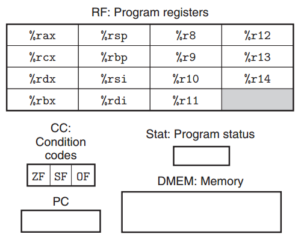
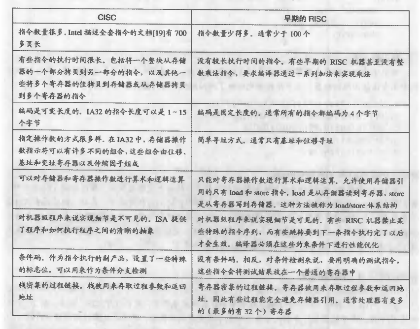
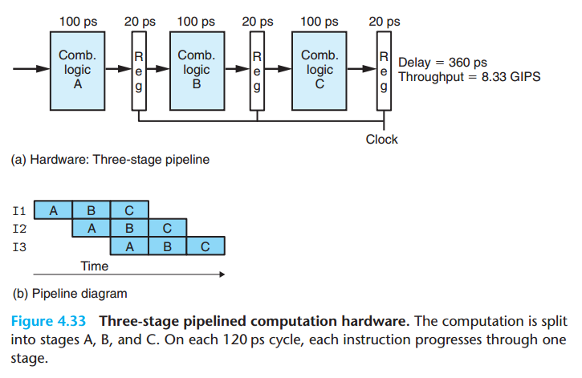
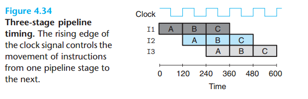
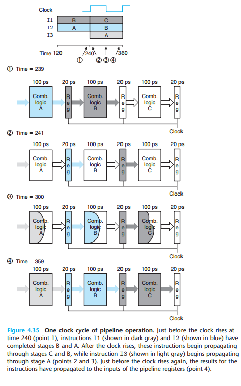

.. contents::
   :depth: 3
..

处理器体系结构
==============

一个处理器支持的指令和指令字节编码称为它的 ISA（Instruction-set
Architecture）。这一章主要讲以Y86指令集体系结构为例讲了处理器中指令的执行流程以及流水的原理和实现。

Y86指令集体系结构
-----------------

Y86
程序中的每条指令都会读取或修改处理器状态的某些部分，这称为程序员（用汇编代码写程序的人或机器级代码的编译器）可见状态：

|image0|

Y86 指令集：

|image1|

指令编码：每条指令的第一个字节表示指令的类型，这个字节分为两个部分，每个部分四位：高四位是代码（code）部分，低四位是功能（function）部分。

|image2|

CISC vs RISC：

|image3|

逻辑设计和硬件控制语言HCL
-------------------------

硬件设计中，电子电路是用来计算位的函数，以及在各种存储器元素中存储位。实现一个数字系统主要有三个部分：计算位的函数的组合逻辑、存储位的存储元素，以及控制存储元素更新的时钟信号。

逻辑门
~~~~~~

逻辑门是数字电路的基本计算元素。它们产生的输出，等于它们输入位值的某个布尔函数。

组合电路和HCL布尔表达式
~~~~~~~~~~~~~~~~~~~~~~~

很多的逻辑门组合成一个网，就能构建计算块，称为组合电路。构建这些网有两条限制：

-  两个或多个逻辑门的输出不能连接在一起。否则它们可能会使线上的信号矛盾，可能会导致一个不合法的电压或电路故障。
-  这个网必须是无环的。也就是在网中不能有路径经过一系列的门而形成一个回路，这样的回路会导致该网络计算的函数有歧义。

字级的组合电路和HCL整数表达式
~~~~~~~~~~~~~~~~~~~~~~~~~~~~~

字级的组合电路： 对数据字（data
word）进行操作的电路，在HCL中，将所有的字级的信号都声明为int，而不指定字的大小。

集合关系
~~~~~~~~

实现将一个信号和众多可能的信号做比较，判断正在处理的某些指令是否属于一类指令代码。

存储器和时钟控制
~~~~~~~~~~~~~~~~

为了产生时序电路，必须引入按位存储信息的设备，考虑两种：

-  时钟寄存器存储单个位或字
-  随机访问存储器存储多个字

Y86的顺序实现
-------------

将处理组织成阶段
~~~~~~~~~~~~~~~~

处理一条指令包含很多操作，我们把其组织成某些特殊的阶段序列，使得即使指令的动作差异很大，但是所有的指令都遵守统一的序列：

-  取指（fetch），取指阶段，从存储器中读入指令，地址为程序计数器（PC）的值
-  解码（decode），解码阶段从寄存器中读入最多两个操作数，得到其值
-  执行（execute），算术逻辑单元（ALU）要么执行指令指明的操作，计算存储器引用的有效地址，要么增加或者减少栈指针。
-  访存（memory），可以将数据写入存储器，或者从存储器中读入数据
-  写回（write back），最多可以写两个结果到寄存器文件
-  更新PC（update PC），将PC设置为下一条PC的地址

流水线的通用原理
----------------

流水线化的系统有一些通用的属性和原理，在流水线系统中，待执行的任务被划分成若干个相互独立的阶段。

计算流水线
~~~~~~~~~~

由一些执行计算的逻辑以及保存计算结果的寄存器组成。时钟信号控制在每个特定的时间间隔加载寄存器。

|image4|

流水线操作的详细说明
~~~~~~~~~~~~~~~~~~~~

三段流水线的时序:

|image5|

流水线操作的一个时钟周期：

|image6|

流水线的局限性
~~~~~~~~~~~~~~

-  不一致的划分
-  流水线过深，收益反而下降（由寄存器延迟造成的）

带反馈的流水线系统
~~~~~~~~~~~~~~~~~~

可能产生的相关：数据相关（data dependency）、顺序相关（sequential
dependency）、控制相关（control dependency）。

Y86的流水线实现
---------------

插入流水线寄存器
~~~~~~~~~~~~~~~~

在SEQ+的各个阶段之间插入流水线寄存器，并对信号重新做排列

对信号做重新排列和标号
~~~~~~~~~~~~~~~~~~~~~~

在流水线化的设计中，对应正在进过系统的各个指令，对指令中处理的值进行重新排列和标号

流水线冒险
~~~~~~~~~~

数据相关和控制相关导致的流水线产生的计算错误，称为冒险。同样，冒险也分为数据冒险和控制冒险两大部分。

用暂停来避免数据冒险
~~~~~~~~~~~~~~~~~~~~

暂停时，处理器会停止流水线中一条或多条指令，直到冒险不再满足。

.. |image1| image:: ../img/y86-64%20instructions.png
.. |image2| image:: ../img/y86_64%20cunction%20code.png

