.. contents::
   :depth: 3
..

存储器层次结构
==============

存储器系统(memory
system)是一个具有不同容量、成本和访问时间的存储设备的层次结构。

具有良好局部性的程序倾向于一次又一次地访问相同的数据项集合，或者是倾向于访问邻近的数据项集合。

存储技术
--------

随机访问存储器
~~~~~~~~~~~~~~

随机访问存储器 (Random-Access Memory, RAM)分为两类：静态的和动态的。SRAM
比 DRAM 更快，但也贵得多。SRAM 用来作为高速缓存存储器，既可以在 CPU
芯片上，也可以在片下。DRAM 用来作为主存以及图形系统的帧缓冲区。

磁盘存储
~~~~~~~~

|image0|

磁盘容量：一个磁盘能够存储的最大位数，由以下因素决定：

-  记录密度，磁道一英寸的段可以放入的位数
-  磁道密度
-  面密度

磁盘操作：用一个连接到传动臂的读写头来读写存储在磁性表面的位

对扇区的访问时间由三个部分组成：寻道时间（seek
time）、旋转时间（rotational latency）、传送时间（transfer time）。

固态硬盘（Solid State Disks）
~~~~~~~~~~~~~~~~~~~~~~~~~~~~~

基于闪存（flash memory）的存储技术：

|image1|

存储技术趋势
~~~~~~~~~~~~

-  不同的存储技术有不同的价格和性能的折中
-  不同存储技术的价格和性能属性以截然不同的速率变化着
-  DRAM 和磁盘访问的时间滞后于 CPU 时钟周期时间

局部性
------

一个编写良好的计算机程序常常具有良好的局部性(locality)。也就是说，它们倾向于引用临近于其他最近引用过的数据项的数据项，或者最近引用过的数据项本身。这种倾向性，被称为局部性原理(principle
of
locality)，是一个持久的概念，对硬件和软件系统的设计和性能都有着极大的影响。

局部性通常有两种不同的形式：时间局部性(temporal
locality)和空间局部性(spatial
locality)。有良好局部性的程序比局部性差的程序运行得更快。

-  重复引用同一个变量的程序有良好的时间局部性
-  对于具有步长为 k 的引用模式的程序，步长越小，空间局部性越好
-  对于取指令来说，循环友好的时间和空间局部性。循环体越小，循环迭代次数越多，局部性越好

.. _存储器层次结构-1:

存储器层次结构
--------------

|image2|

在存储器层次结构中的缓存
~~~~~~~~~~~~~~~~~~~~~~~~

一般而言，高速缓存(cache)是一个小而快速的存储设备。使用高速缓存的过程称为缓存命中(caching)。

存储器层次结构的中心思想是，对于每个 ``k``\ ，位于 ``k``
层的更快更小的存储设备作为位于 ``k+1``
层的更大更慢的存储设备的缓存。换句话说，层次结构中的每一次都缓存来自较低一层的数据对象。

数据总是以块大小为传送单元(transfer unit)在第 ``k`` 层和第 ``k+1``
层之间来回拷贝的。虽然在层次结构中任何一对相邻的层次之间块大小是固定的，但是其他的层次对之间可以用不同的块大小。一般而言，层次结构较低的层(离
CPU
较远)的设备访问时间较长，因此为了补偿这些较长的访问时间，倾向于使用较大的块。

|image3|

缓存命中： 当程序需要第 ``k+1`` 层的某个数据对象 ``d``
时，它首先在当前存储的第 ``k`` 层的一个块中查找 ``d``\ 。如果 ``d``
刚好缓存在第 ``k`` 层中，那么就是缓存命中(cache hit)。

缓存不命中：如果第 ``k`` 层中没有缓存数据对象
``d``\ ，那么就是缓存不命中(cache miss)。当发生 cache miss
时，会从下一次取出包含 ``d`` 的那个块，如果第 ``k``
层的缓存已经满了的话，可能就会覆盖现存的一个块。

覆盖一个现存的块的过程称为替换(replacing)或驱逐(evicting)。被驱逐的看这个块有时也称为牺牲块(victim
block)。决定该替换那个块是由缓存的替换策略(replacement
policy)来控制的。(LRU, LFU 等等替换策略在这里可以使用)。

缓存不命中的种类： 一个空的缓存有时称为冷缓存(cold
cache)，此类不命中称为 compulsory miss 或 cold miss。

存储器层次结构概念小结
~~~~~~~~~~~~~~~~~~~~~~

存储器层次结构行之有效，因为较慢的设备比较快的设备更便宜，还因为程序偏向于展示局部性：

-  利用时间局部性，同一数据对象可能会被多次使用
-  利用空间局部性，块通常包含有多个数据对象

|image4|

高速缓存存储器
--------------

早期计算机系统的存储器结构只有三层：CPU 寄存器、DRAM
主存储器和磁盘存储。不过，由于 CPU
和主存之间逐渐增大的差距，系统设计者被迫在 CPU
寄存器文件和主存之间插入了一个小的 SRAM 高速缓存存储器，称为 L1
高速缓存。之后又插入了一个更大的高速缓存，称为 L2 高速缓存，之后还有 L3
高速缓存。周期数：L1(2~4), L2(~10), L3(\ :sub:`30`\ 40)。

通用的高速缓存存储结构
~~~~~~~~~~~~~~~~~~~~~~

|image5|

直接映射高速缓存
~~~~~~~~~~~~~~~~

每个组只有一行（E=1）的高速缓存被称为直接映射高速缓存：

|image6|

|image7|

组相联高速缓存
~~~~~~~~~~~~~~

直接映射高速缓存中冲突不命中造成的问题是源于每一个组只有一行，组相联高速缓存（set
associative
cache）放松了这条限制，所以每个组都保存了有多于一行的高速缓存。

|image8|

|image9|

全相联高速缓存
~~~~~~~~~~~~~~

由一个包含所有高速缓存行的组（E = C/B）组成：

|image10|

有关写的问题
~~~~~~~~~~~~

更新写命中的缓存的方法：

-  直写（write-throuth），立即将w的高速缓存块写回到存储器中，优点是简单，缺点是每条存储指令都会引起总线上面的一个写事务。
-  写回（write-back），尽可能推迟存储器的更新，只有当替换算法要驱逐已更新块时，才写入存储器中，优点是能够显著减少总线事务的数量，缺点是增加复杂性，需要额外维护一个修改位（dirty
   bit）。

处理写不命中的方法：

-  写分配（write-allocate），加载相应的存储器块到高速缓存中，然后更新这个高速缓存块。
-  非写分配（not-write-allocate），避开高速缓存，直接把字写到存储器中。

指令高速缓存和统一高速缓存
~~~~~~~~~~~~~~~~~~~~~~~~~~

只保存指令的高速缓存成为i-cache，只保存程序数据的高速缓存称为d-cache，即保存指令又保存程序数据的高速缓存称为统一的高速缓存（unified
cache）。

|image11|

高速缓存参数的性能影响
~~~~~~~~~~~~~~~~~~~~~~

衡量性能的指标：

-  不命中率
-  命中率
-  命中时间
-  不命中处罚

影响：

-  高速缓存大小
-  块大小
-  相联度
-  写策略

编写高速缓存友好的代码
----------------------

-  让最常见的情况运行得快
-  在每个循环内部使缓存不命中数量小

高速缓存对程序性能的影响
------------------------

存储器山（memory mountain）

|image12|

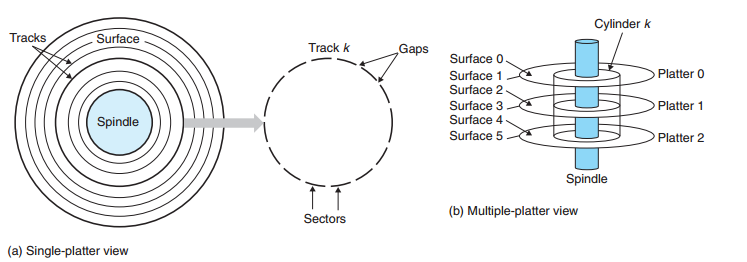
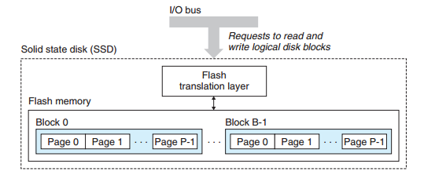
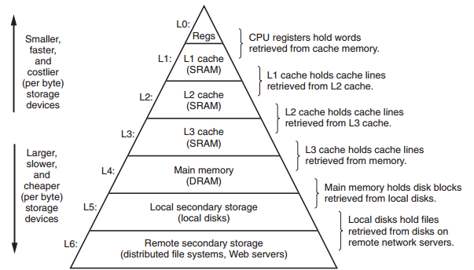
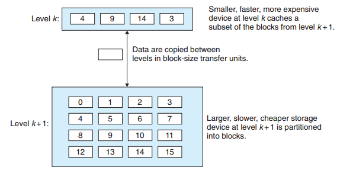
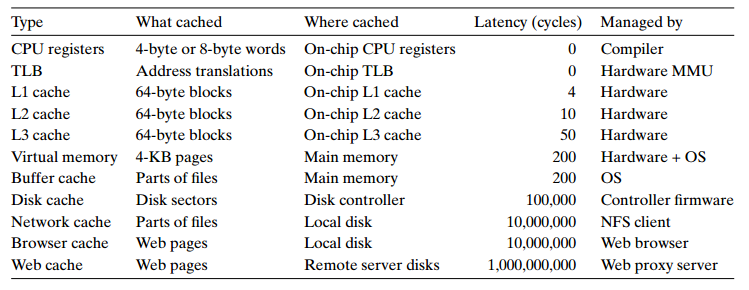
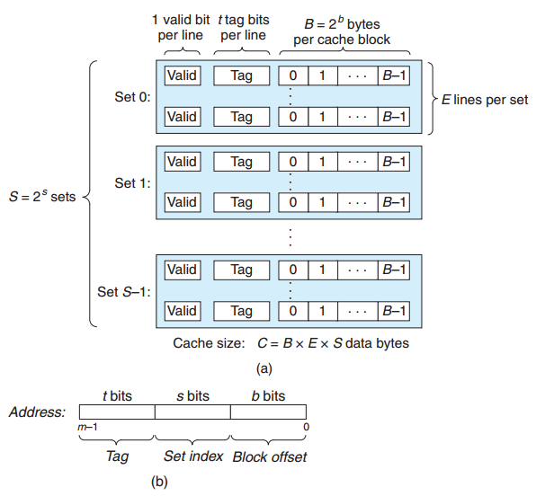
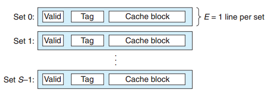
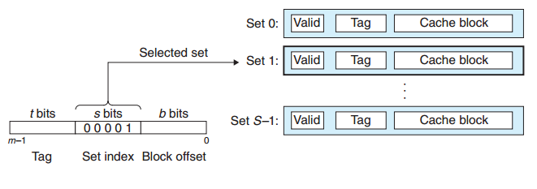
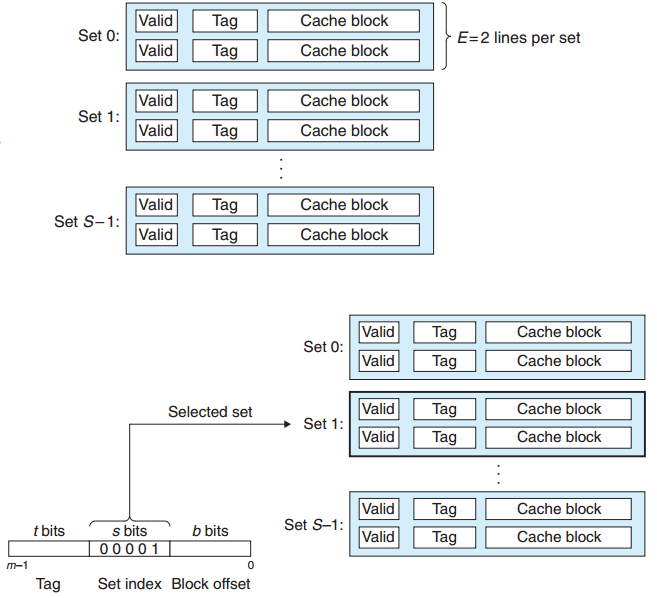
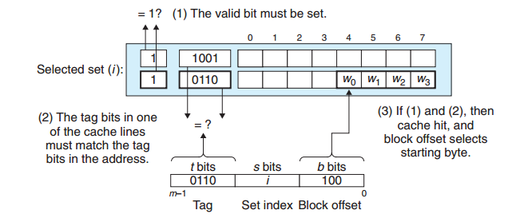
.. |image10| image:: ../img/fully_associate.png
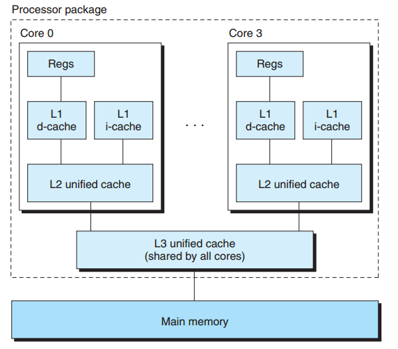
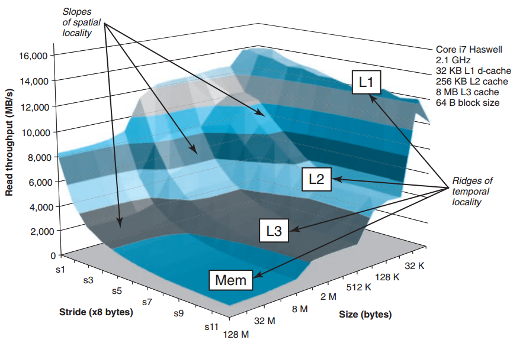
