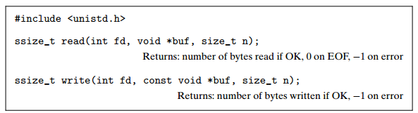
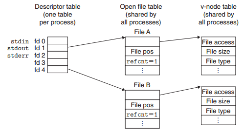
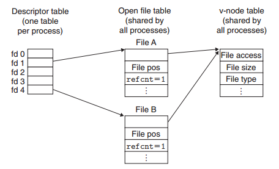
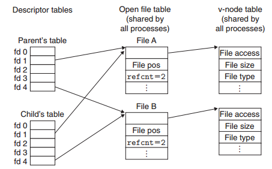
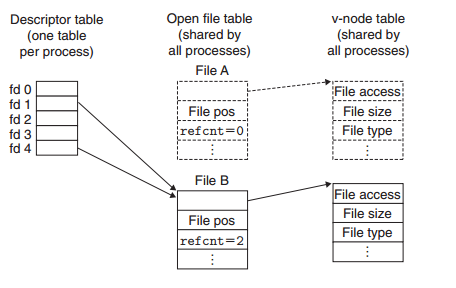

.. contents::
   :depth: 3
..

系统级I/O
=========

输入/输出（I/O）是在主存（memory）和外部设备之间拷贝数据的过程。输入数据是从
I/O 设备拷贝数据到主存，输出数据是从主存拷贝数据到 I/O 设备。

Unix I/O
--------

所有的的I/O设备都模型化为文件，而所有的输入和输出都当作相应文件的读和写来执行。

所有的输入输出都以一种统一且一致的方式来执行：

-  打开文件
-  改变当前的文件位置
-  读写文件
-  关闭文件

打开和关闭文件
--------------

``open`` 函数将 ``filename``
转换为一个文件描述符，并且返回描述符数字。返回的描述符总是在进程中当前没有打开的最小描述符。

读和写文件
----------

|image0|

``read``\ 函数从描述符为 ``fd`` 的当前文件位置拷贝至多 ``n``
个字节到存储器位置 ``buf``\ 。

``write`` 函数从存储器位置拷贝至多 ``n``
个字节到描述符fd的当前文件位置。

通过调用\ ``lseek``\ 函数，应用程序能够显式地修改当前文件的位置。

共享文件
--------

可以用许多不同的方式来共享 Unix
文件。内核用三个相关的数据结构来表示打开的文件：

-  描述符表(descriptor
   table)。每个进程都有它独立的描述符表，它的表项是由进程打开的文件描述符来索引的。每个打开的描述符表指向文件表中的一个表项。
-  文件表(file
   table)。打开文件的集合是由一张文件表来表示的，所有的进程共享这张表。每个文件表的表项包括当前的文件位置、引用计数(reference
   count)，以及一个指向 v-node 表中对应表项的指针。
-  v-node 表(v-node
   table)。同文件表一样，所有的进程共享这张表。每个表项包含 ``stat``
   结构中的大多数信息。

|image1|

多个描述符也可以通过不同的文件表表项来引用同一个文件：

|image2|

子进程继承父进程打开文件：

|image3|

I/O重定向
---------

|image4|

我们该使用哪些I/O函数
---------------------

|image5|

.. |image5| image:: ../img/unix%20io_standard%20io_rio.png
