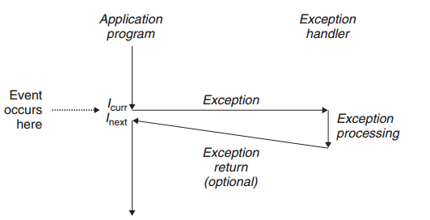
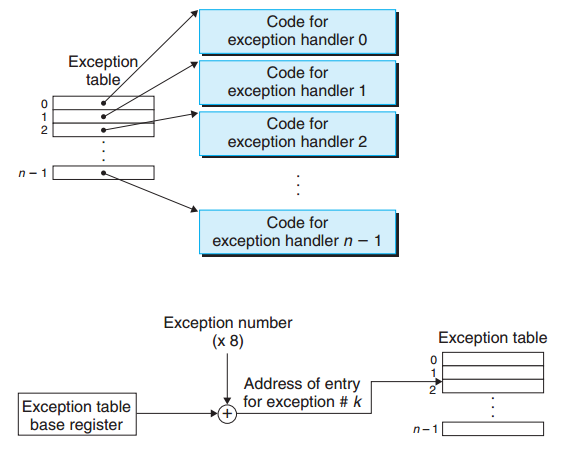
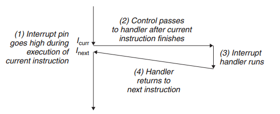
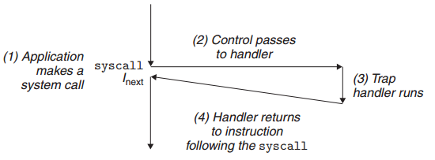
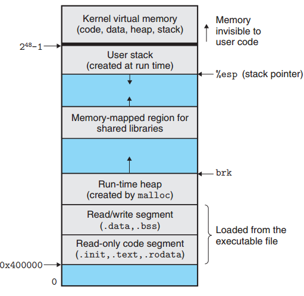
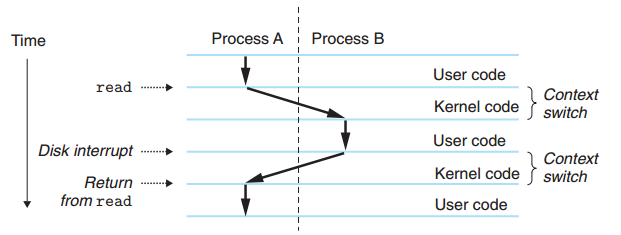
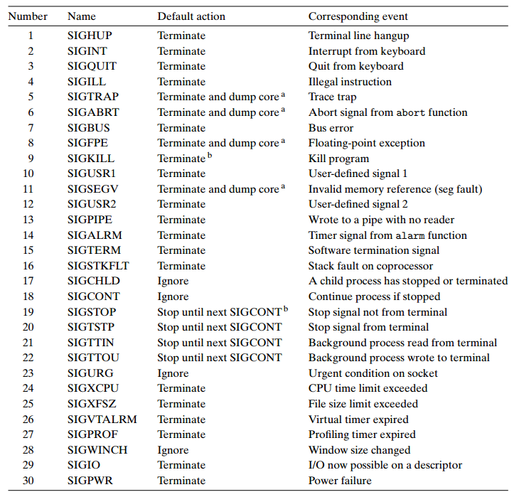

# 异常控制流

处理器按照一定的序列的地址执行对应的指令，从这一个地址过渡到下一个地址成为控制转移，这样的控制转移序序列称为处理器的控制流（flow control）。

系统必须能够对系统状态的变化做出反应，这些系统状态不是被内部程序变量捕获的，而且也不一定要和程序的执行相关。比如，一个硬件定时器定期产生信号，这个事件必须得到处理。当子进程终止时，创造这些子进程的父进程必须得到通知。

现代系统通过使控制流发生突变来对这些情况做出反应。一般而言，我们把这些突变称为异常控制流(Exceptional Control Flow, ECF)。异常控制流发生在计算机系统的各个层次。比如，在硬件层，硬件检测到的事件会触发控制突然转移到异常处理程序。在操作系统层，内核通过上下文转换将控制从一个用户进程转移到另一个用户进程。在应用层，一个进程可以发送信号到另一个进程，而接受者会将控制突然转移到它的一个信号处理程序。一个程序可以通过回避通常的栈规则，并执行到其他函数中任意位置的非本地跳转来对错误做出反应。

##  异常

异常是异常控制流的一种形式，它一部分是由硬件实现的，一部分是由操作系统实现的。因为它们有一部分是由硬件实现的，所以具体细节将随系统的不同而有所不同。然而，对于每个系统而言，基本的思想都是相同的。

异常(exception)就是控制流中的突变，用来响应处理器状态中的某些变化。如下图所示：



在任何情况下，当处理器检测到有事件发生时，它就会通过一张叫做异常表(exception table)的跳转表，进行一个间接过程调用(异常)，到一個专门设计用来处理这类事件的操作系统子程序(异常处理程序, exception handler)。

当异常处理程序完成处理后，根据引起异常的事件的类型，会发生以下三种情况中的一种：

- 处理程序将控制返回给当前指令 `curr`，即当事件发生时正在执行的指令。
- 处理程序将控制返回给 `next`，即如果没有发生异常将会执行的下一条指令。
- 处理程序被中断的程序。

### 异常处理

系统中可能的每种类型的异常都分配了一个唯一的非负整数的异常号(exception number)。其中一些号码是由处理器的设计者分配的，其他号码是由操作系统内核的设计者分配的。前者的示例包括被零除、缺页、存储器访问违例以及算术溢出。后者的示例包括系统调用和来自外部 I/O 设备的信号。

在系统启动时，操作系统分配和初始化一张称为异常表的跳转表，使得条目 `k` 包含异常 `k` 的处理程序的地址。



异常号是到异常表中的索引，异常表的起始地址放在一个叫做异常表基址寄存器(exception table base register)的特殊 CPU 寄存器里。

### 异常的类别

异常可以分为四类：中断（interrupt）、陷阱（trap）、故障（fault）和终止（abort）


#### 中断

中断是异步发生的，是来自处理器外部的 I/O 设备的信号的结果。硬件中断不是由任何一条专门的指令造成的，从这个意义上来说它是异步的。硬件中断的异常处理程序通常称为中断处理程序(interrupt handler)。



剩下的异常类型(陷阱、故障和终止)是同步发生的，是执行当前指令的结果。我们把这类指令叫做故障指令(faulting instruction)。

#### 陷阱

陷阱是有意的异常，是执行一条指令的结果。就像中断处理程序一样，陷阱处理程序将控制返回到下一条指令。陷阱最重要的用途是在用户程序和内核之间提供一个像过程一样的接口，叫做系统调用。



#### 故障

故障由错误情况引起，它可能被故障处理程序修正。当故障发生时，处理器将控制转移给故障处理程序。如果处理程序能够修正这个错误情况，它就将控制返回到引起故障的指令，从而重新执行它。否则，处理程序返回到内核中的 `abort` 例程，`abort` 例程会终止引起故障的应用程序。


一个经典的故障示例是缺页异常，当指令引用一个虚拟地址，而与该地址相对应的物理页面不在存储器中，因此必须从磁盘中取出时，就会发生故障。一个页面就是虚拟存储器的一个连续的块。缺页处理程序从磁盘加载适当的页面，然后将控制返回给引起故障的指令。当指令再次执行时，相应的物理页面已经驻留在存储器中了，指令就可以没有故障地运行完成了。

#### 终止

终止是不可恢复的致命错误造成的结果，通常是一些硬件错误，比如 DRAM 或者 SRAM 位被损坏时发生的奇偶错误。终止程序从不将控制返回给应用程序。


### x86-64 系统异常


## 进程

异常是允许操作系统提供进程(process)的概念所需要的基本构造块，进程是计算机可续重最深刻最成功的概念之一。当我们在一个现代系统上运行一个程序时，会得到一个假象，就好像我们的程序是系统中当前运行着的唯一的程序。

进程的经典定义就是一个执行中的程序的实例。系统中的每个程序都是运行在某个进程的上下文(context)中的。上下文是由程序正确运行所需的状态组成的。这个状态包括存放在存储器中的程序的代码和数据，它的栈、通用目的寄存器的内容、程序计数器、环境变量以及打开文件描述符的集合。

每次用户通过向外壳输入一个可执行目标文件的名字，并运行一个程序时，shell 就会创建一个新的进程，然后在这个新进程的上下文中运行这个可执行目标文件。应用程序也能够创建新进程，且在这个新进程的上下文中运行它们自己的代码或其他应用程序。

### 逻辑控制流

即使在系统中通常有许多其他程序在运行，进程也可以向每个程序提供一种假象，好像它在独占地使用处理器。如果想用调试器单步执行程序，我们会看到一系列的程序计数器(PC)的值，这些值唯一地对应于包含在程序的可执行目标文件中的指令，或者是包含在运行时动态链接到程序的共享对象的指令。这个 PC 值的序列叫做逻辑控制流。


进程是轮流使用处理器的，每个进程执行它流中的一部分，然后被抢占（preempted）（暂时挂起），与此同时其他进程开始执行。

### 并发流

一个逻辑流的执行在时间上与另一个流重叠，称为并发流(concurrent flow)，这两个流被称为并发地运行。更准确地说，流 X 和 Y 互相并发，当且仅当 X 在 Y 开始之后和 Y 结束之前开始，或者 Y 在 X 开始之后和 X 结束之前开始。

多个流并发地执行的一般现象称为并发(concurrency)。一个进程和其他进程轮流运行的概念称为多任务(multitasking)。一个进程执行它的控制流的一部分的每一时间段叫做时间片(time slice)。因此，多任务也叫做时间分片(time slicing)。

注意，并发的思想与流运行的处理器核数或者计算机无关。如果两个流在时间上重叠，那么它们就是并发的，即使它们是运行在同一个处理器上的。如果两个流并发地运行在不同的处理器核或者计算机上，那么我们称它们为并行流(parallel flow)。

### 私有地址空间

进程也为每个程序提供一种假象，好像它独占地使用系统地址空间。尽管和每个私有地址空间相关联的存储器的内容一般是不同的，但是每个这样的空间都有相同的通用结构，如下图所示：



### 用户模式和内核模式

为了使操作系统内核提供一个无懈可击的进程抽象，处理器必须提供一种机制，限制一个应用可以执行的指令以及它可以访问的地址空间范围。

处理器通常是用某个控制寄存器中的一个模式位(mode bit)来提供这种功能的，该寄存器描述了进程当前享有的特权。当设置了模式位，进程就运行在内核模式(超级用户模式)。一个运行在内核模式的进程可以执行指令集中的任何指令，并且可以访问系统中任何存储器位置。

没有设置模式位时，进程就运行在用户模式中。用户模式中的进程不允许执行特权指令(priviledged instruction)，比如停止处理器、改变位模式，或者发起一个 I/O 操作。也不允许用户模式中的进程直接引用地址空间中内核区内的代码和数据。任何这样的尝试都会导致致命的保护故障。反之，用户程序必须通过系统调用接口间接地访问内核代码和数据。

Linux 提供了一种聪明的机制，叫做 `/proc` 文件系统，它允许用户模式进程访问内核数据结构的内容。`/proc`文件系统将许多内核数据结构的内容输出为一个用户程序可以读的文本文件的层次结构。

### 上下文切换

操作系统内核使用一种称为上下文切换(context switch)的较高层形式的异常控制流来实现多任务。上下文切换机制是建立在那些较低层异常机制之上的。

内核为每个进程维持一个上下文(context)。上下文就是内核重新启动一个被抢占的进程所需的状态。它由一些对象的值组成，这些对象包括通用目的寄存器、浮点寄存器、程序计数器、用户栈、状态寄存器、内核栈和各种内核数据结构，比如描绘地址空间的页表、包含有关当前进程信息的进程表，以及包含进程已打开文件的信息的文件表。

在进程执行的某些时刻，内核可以决定抢占当前进程，并重新开始一个先前被抢占的进程。这种决定就叫做调度(schedule)，是由内核中称为调度器(scheduler)的代码处理的。当内核选择一个新的进程运行时，我们就说内核调度了这个进程。



## 系统调用和错误处理

Unix 提供大量的系统调用，当应用程序想向内核请求服务时，可以使用这些系统调用。

标准 C 库提供一组针对最常用系统调用的方便的包装（wrapper）函数。

通过使用错误处理包装（error-handling wrapper）函数，我们可以进一步简化我们的代码。

## 进程控制

###  获取进程

每个进程都有一个唯一的正数进程 ID(PID)。`getpid` 函数返回调用进程的 PID。`getppid` 函数返回它的父进程的 PID。

### 创建和终止进程

从程序员的角度，我们可以认为进程总是处于下面三种状态之一：

- 运行。进程要么在 CPU 上执行，要么在等待被执行且最终会被内核调度。
- 停止。进程的执行被挂起(suspend)，且不会被调度。当收到 SIGSTOP、SIGTSTP、SIDTTIN 或者 SIGTTOU 信号时，进程就停止，并且保持停止直到它收到一个 SIGCONT 信号，在这个时刻，进程再次开始运行。
- 终止。进程永远地停止了。进程会因为三种原因终止：
  - 收到一个默认行为是终止进程的信号
  - 从主程序返回
  - 调用 exit 函数

父进程通过调用 `fork` 函数创建一个新的运行子进程，子进程返回0，父进程返回子进程的 PID，如果出错则为 -1。

```
#include <sys/types.h>
#include <unistd.h>

pid_t fork(void);
```

新创建的子进程几乎但不完全与父进程相同。子进程得到与父进程用户级虚拟地址空间相同的(但是独立的)一份拷贝，包括文本、数据和 bss 段、以及用户栈。子进程还获得与父进程任何打开文件描述符相同的拷贝。父进程和新创建的子进程最大的区别在于他们有不同的 PID。

`fork` 函数只被调用一次，却会返回两次(父进程与子进程)。因为子进程的 PID 总是非零的，返回值就提供一个明确的方法来分辨程序是在父进程还是在子进程中执行。

使用`fork`创建一个新进程：

```
#include "csapp.h"
 
int main()
{
	pid_t pid;
	int x = 1;
	 
	pid = Fork();
	if (pid == 0) { /* Child */
	printf("child : x=%d\n", ++x);
	exit(0);
	}

	/* Parent */
	printf("parent: x=%d\n", --x);
	exit(0);
}
```

这个例子有一些微妙的方面：

- 调用一次，返回两次
- 并发执行。顺序不能保证
- 相同但是独立的地址空间，所以变量是分别独立的
- 共享文件，输出是指向同一个地方

### 回收子进程

当一个进程由于某种原因终止时，内核并不是立即把它从系统中清除。相反，进程被保持在一种已终止的状态中，直到被它的父进程回收(reap)。当父进程回收已终止的子进程时，内核将子进程的退出状态传递给父进程，然后抛弃已终止的进程。一个终止了但还未被回收的进程称为僵尸进程(zombie)。

如果父进程没有回收它的僵尸子进程就终止了，那么内核就会安排 `init` 进程来回收它们。`init` 进程的 PID 为 1，并且是在系统初始化时由内核创建的。长时间运行的程序，比如 `shell` 或者服务器，总是应该回收它们的僵尸子进程。即使僵尸子进程没有运行，它们仍然小号系统的存储器资源。

一个进程可以通过调用 `waitpid` 函数来等待它的子进程终止或者停止。如果成功，则返回子进程的 PID，如果 WHOHANG ，则为 0，如果其他错误，则为 -1。

### 让进程休眠

`sleep` 函数让一个进程挂起一段指定的时间。返回还要休眠的秒数。

如果请求的时间量已经到了，`sleep`返回 0，否则返回还剩下要休眠的秒数。我们会发现很有用的另一个函数是 `pause` 函数，该函数让调用函数休眠，直到该进程收到一个信号。总是返回 -1。

### 加载并运行程序

`execve` 函数在当前进程的上下文中加载并运行一个新程序。如果成功则不返回，如果错误，则返回 -1。

```
#include <unistd.h>

int execve(const char *filename, const char *argv[], const char *envp[]);
```

## 信号

一个信号就是一条小消息，它通知进程系统中发生了一个某种类型的事件。

linux signals：



### 信号术语

传送一个信号到目的进程是由两个不同步骤组成的：

- 发送信号。内核通过更新目的进程上下文中的某个状态，发送一个信号给目的进程。发送信号可以用如下两个原因
  - 内核检测到一个系统事件，比如被零除错误或者子进程终止。
  - 一个进程调用 `kill` 函数，显式地要求内核发送一个信号给目的进程。一个进程可以发送信号给它自己。
- 接收信号。当目的进程被内核强迫以某种方式对信号的发送做出反应时，目的进程就接收了信号。进程可以忽略这个信号，终止或者通过执行一个称为信号处理程序(signal handler)的用户层函数捕获这个信号。

一个只发出而没有被接收的信号叫做待处理信号(pending signal)。在任何时刻，一种类型至多只会有一个待处理信号。如果一个进程有一个类型为 `k` 的待处理信号，那么任何接下来发送到这个进程的类型为` k` 的信号都不会排队等待，它们只是被简单地丢弃。一个进程可以有选择地阻塞接收某种信号。当一种信号被阻塞时，它仍可以被发送，但是产生的待处理信号不会被接收，直到进程取消对这种信号的阻塞。

一个待处理信号最多只能被接收一次。内核为每个进程在 `pending` 位向量中维护着待处理信号的集合，而在 `blocked` 位向量中维护着被阻塞的信号集合。只要传送了一个类型为 `k` 的信号，内核就会设置 `pending` 中的第 `k` 位，而只要接收了一个类型为 `k` 的信号，内核就会清除 `pending` 中的第 `k` 位。

### 发送信号

Unix 系统提供了大量向进程发送信号的机制。所有这些机制都是基于进程组(process group)这个概念的。

进程组：每个进程都只属于一个进程组，进程组是由一个正整数进程组 ID 来标识的。`getpgrp` 函数返回当前进程的进程组 ID。

默认的，一个子进程和它的父进程同属一个进程组。一个进程可以通过使用 `setpgid` 函数来改变自己或者其他进程的进程组，成功则返回 0，否则返回 -1。

- 用 `/bin/kil` 程序发送信号
- 从键盘发送信号
- 用 `kill` 函数发送信号
- 用 `alarm` 函数发送信号

### 接受信号

当内核从一个异常处理程序返回，准备将控制传递给进程 p 时，它会检查进程 p 的未被阻塞的待处理信号的集合(pending&~blocked)。如果这个集合为空(通常情况下)，那么内核将控制传递到 p 的逻辑控制流中的下一条指令。

### 信号处理问题

当一个程序要捕获多个信号时，一些细微的问题就产生了：

- 待处理信号被阻塞
- 待处理信号不会排队等待
- 系统调用可以被中断

不可以用信号来对其他进程中发生的事件计数。

### 可移植的信号处理

不同系统之间，信号处理语义的差异是 Unix 信号处理的一个缺陷。为了处理这个问题，Posix 标准定义了`sigaction` 函数，它允许用户明确指定他们想要的信号处理语义。

###  显式地阻塞信号

使用 `sigprocmask` 函数。

## 非本地跳转

C 语言提供了一种用户级一场控制流形式，称为非本地跳转(nonlocal jump)，它将控制直接从一个函数转移到另一个当前正在执行的函数，而不需要经过正常的调用——返回序列，通过 `setjmp` 和 `longjmp` 函数来提供的。

非本地跳转的另一个重要应用是使一个信号处理程序分支到一个特殊的代码位置，而不是返回到被信号到达中断了的指令的位置。

## 操作进程的工具

Linux 系统提供了大量的监控和操作进程的有用工具：

- STRACE：打印一个正在运行的程序和它的子进程调用的每个系统调用的轨迹。用 -static 编译你的程序，能得到一个更干净的、不带有大量与共享库相关的输出的 trace
- PS：列出当前系统中的进程(包括僵僵尸进程)
- TOP：打印出关于当前进程资源使用的信息
- PMAP：显示进程的存储器映射
- /proc：一个虚拟文件系统，以 ASCII 文本格式输出大量内核数据结构的内容，用户可以读取这些内容


