# 虚拟存储器

一个系统中的进程是与其他进程共享 CPU 和主存资源的。然而，共享主存会形成一些特殊的挑战。随着对 CPU 需求的增长，进程以某种合理的平滑方式慢了下来。但是如果太多的进程需要太多的存储器，那么它们中的一些就根本无法运行。当一个程序没有空间可用时，那就是它运气不好了。存储器还很容易被破坏。如果某个进程不小心写了另一个进程使用的存储器，它就可能以某种完全和程序逻辑无关的令人迷惑的方式失败。

为了更加有效地管理存储器并且少出错，现代系统提供了一种对主存的抽象概念，叫做虚拟存储器(VM)。虚拟存储器是硬件异常、硬件地址翻译、主存、磁盘文件和内核软件的完美交互，它为每个进程提供了一个大的、一致的和私有的地址空间。通过一个很清晰的机制，虚拟存储器提供了三个重要的能力：

- 它将主存看成是一个存储在磁盘上的地址空间的高速缓存，在主存中只保存活动区域，并根据需要在磁盘和主存之间来回传送数据，通过这种方式，它高效地使用了主存。
- 它为每个进程提供了一致的地址空间，从而简化了存储器管理。
- 它保护了每个进程的地址空间不被其他进程破坏。

虚拟存储器是计算机系统最重要的概念之一。它成功的一个主要原因就是因为它是沉默地、自动地工作的，不需要应用程序员的任何干涉。

## 物理和虚拟寻址

计算机系统的主存被组织成一个由 M 个连续的字节大小的单元组成的数组。每字节都有一个唯一的物理地址(Physical Address, PA)。第一个字节的地址为 0，接下来的字节地址为 1，再下一个为 2，以此类推。给定这种简单的结构，CPU 访问存储器的最自然的方式就是使用物理地址。我们把这种方式称为物理寻址(physical addressing)。

现代处理器使用的是一种称为虚拟寻址(virtual addressing)的寻址形式：

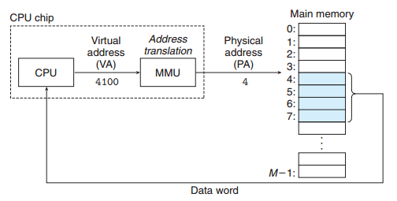

## 地址空间

地址空间(address space)是一个非负整数地址的有序集合：{0, 1, 2, …}。如果地址空间中的整数是连续的，那么我们说它是一个线性地址空间(linear address space)。

地址空间的概念是很重要的，因为它清楚地区分了数据对象(字节)和它们的属性(地址)。

允许每个数据对象有多个独立的地址，其中每一个地址都选自一个不同的地址空间。这就是虚拟存储器的基本思想。

## 虚拟存储器作为缓存的工具

概念上而言，虚拟存储器(VM)被组织为一个由存放在磁盘上的 N 个连续的字节大小的单元组成的数组。每字节都有一个唯一的虚拟地址，这个唯一的虚拟地址是作为到数组的索引的。VM 系统通过将虚拟存储器分割为虚拟页(Virtual Page, VP)的大小固定的块来处理这个问题。每个虚拟页的大小为 `P=2^p` 字节。类似地，物理存储器被分割为物理页(Physical Page, PP)，大小也为 P 字节(物理页也称为页帧(page frame))。

在任意时刻，虚拟页面的集合部分都分为三个不相交的子集：

- 未分配的：VM 系统还未分配(或者创建)的页。未分配的块没有任何数据和它们相关联，因此也就不占用任何磁盘空间。
- 缓存的：当前缓存在物理存储器中的已分配页。
- 未缓存的：没有缓存在物理存储器中的已分配页。

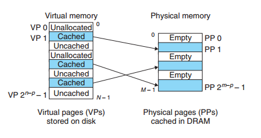

### DRAM高速缓存的组织结构

在存储层次结构中，DRAM 缓存的位置对于他的组织结构有很大的影响。DRAM 缓存的组织结构完全是由巨大的不命中开销驱动的。因为大的不命中处罚和访问第一字节的开销，虚拟页往往很大，典型地是 4KB-2MB。由于大的不命中处罚，DRAM 缓存是全相连的，也就是说，任何虚拟页都可以放置在任何的物理页中。不命中时的替换策略也很重要，因为替换错了虚拟页的出发也非常高。因此，与硬件对 SRAM 缓存相比，操作系统对 DRAM 缓存使用了更复杂精密的替换算法。最后，因为对磁盘的访问时间很长，DRAM 缓存总是使用写回(write back)，而不是直写。

### 页表

同任何缓存一样，虚拟存储器系统必须有某种方法来判定一个虚拟页是否存放在 DRAM 中的某个地方。如果是，系统还必须确定这个虚拟页存放在哪个物理页中。如果不命中，系统必须判断这个虚拟页存放在磁盘的哪个位置，在物理存储器中选择一个牺牲页，并将虚拟页从磁盘拷贝到 DRAM 中，替换这个牺牲页。

这些功能是由许多软硬件联合提供的，包括操作系统软、MMU(存储器管理单元)中的地址翻译硬件和一个存放在物理存储器中叫做页表(page table)的数据结构，页表将虚拟页映射到物理页。每次地址翻译硬件将一个虚拟地址转换为物理地址时都会读取页表。操作系统负责维护页表的内容，以及在磁盘与 DRAM 之间来回传送页。

下图展示了一个页表的基本组织结构。页表就是一个页表条目(Page Table Entry, PTE)的数组。虚拟地址空间中的每个页在页表中一个固定偏移量处都有一个 PTE。

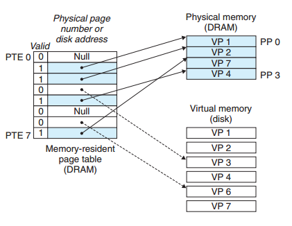

### 页命中

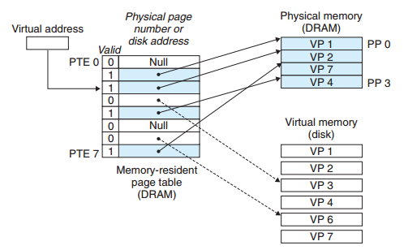

### 缺页

在虚拟存储器的习惯说法中，DRAM不命中称为缺页（page fault）。缺页异常调用内核中缺页异常处理程序，该程序会选择一个牺牲页。在磁盘和存储器之间传送页的活动叫做交换(swapping)或者页面调度(paging)。

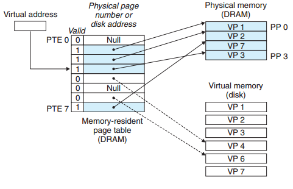

### 分配页面

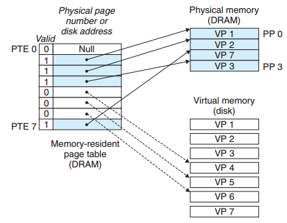

### 局部性再次搭救

尽管在整个运行过程中程序引用的不同页面的总数可能超出物理存储器总的大小，但是局部性原则保证了在任意时刻，程序往往在一个较小的活动页面(active page)集合上工作，这个集合叫做工作集(working set)或者常驻集(resident set)。

如果工作集的大小超出了物理存储器的大小，那么程序将产生一种不幸的状态，叫做颠簸（thrashing），这时页面将不断的换进换出。

## 虚拟存储器作为存储管理的工具

OS 为每个进程提供一个独立的页表，就是一个独立的虚拟地址空间。多个虚拟页面可以映射到同一个共享物理页面上。

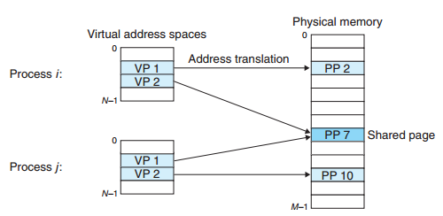

## 虚拟存储器作为存储器保护的工具

任何现代计算机系统都必须为操作系统提供手段来控制对存储器系统的访问。提供独立地址空间使得分离不同进程私有存储器变得容易。地址翻译机制可以以一种自然的方式扩展到提供更好的访问控制。

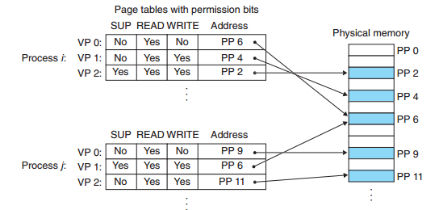

## 地址翻译

地址翻译的基础知识：

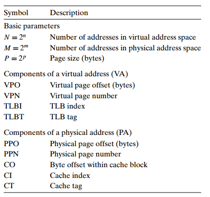

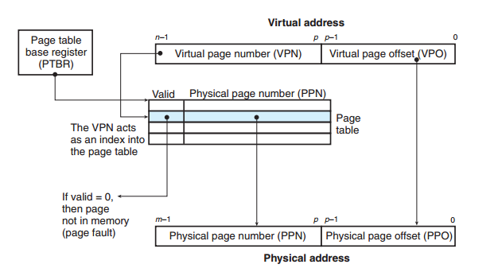

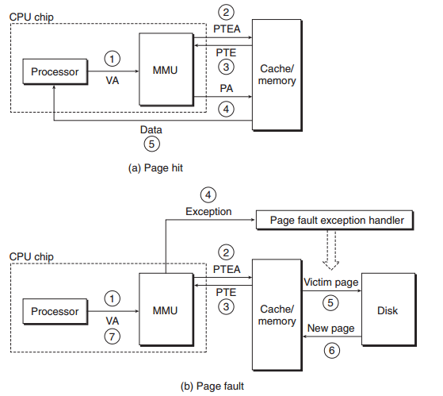

### 结合高速缓存和虚拟存储器

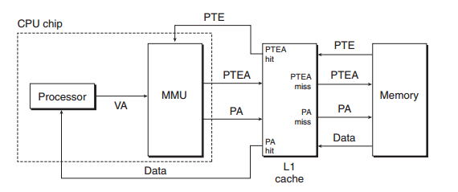

### 利用TLB加速地址翻译

TLB是一个小的、虚拟地址的缓存，其中每一行都保存着一个由单个PTE组成的块。TLB通常有高度的相连性。

### 多级页表

## 存储器映射

Linux 通过将一个虚拟存储器区域与一个磁盘上的对象关联起来，以初始化这个虚拟存储器区域的内容，这个过程叫存储器映射（memory mapping）
虚拟存储器区域可以映射到两种类型的对象：

- Unix 文件系统的普通文件
- 匿名文件

### 再看共享对象

存储器映射的概念来源于一个聪明的发现：如果虚拟存储器系统可以集成到传统的文件系统中，那么就能提供一种简单而高效的把程序和数据加载到存储器中的方法。

一个对象可以被映射到虚拟存储器中的一个区域，要么作为共享对象，要么作为私有对象。另一个方面，对于一个映射到私有对象的区域所做的改变，对于其他进程来说是不可见的，而且进程对这个区域所做的任何写操作都不会反映在磁盘的对象中。

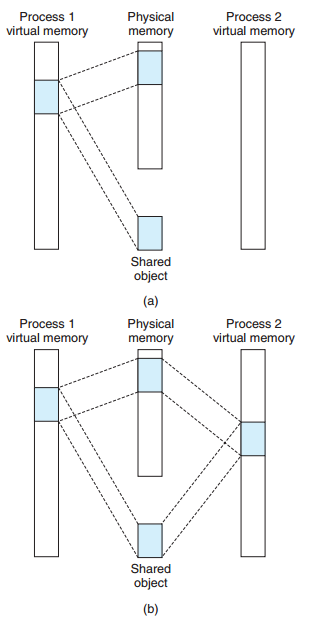

私有对象是使用一种写时拷贝（copy-on-write）的巧妙技巧被映射虚拟存储器中的。

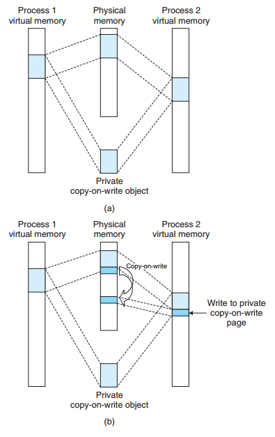

## 动态存储器分配

一个动态存储器分配器维护着一个进程的虚拟存储器区域，称为堆（heap）。

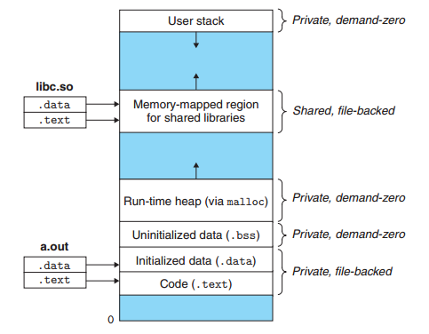

显式分配器要求应用显式地释放任何已经分配的块。

隐式分配器要求检测何时一个已分配块不再被使用，然后就释放这个块。隐式分配器也叫做垃圾收集器（garbage collector）。

### 为什么要使用动态存储器分配

经常直到程序运行时，才知道某些数据结构的大小。

### 碎片

造成堆利用率低的主要原因是碎片（fragmentation），当虽然有未使用的存储器但是不能用来满足分配请求时，就发生这种现象。有两种碎片形式：内部碎片（internal fragmentation）和外部碎片（external fragmentation）：

- 内部碎片是在一个已分配块比有效载荷大时发生的。
- 外部碎片是当空闲存储器合计起来足够满足一个分配请求，但是没有一个单独的空闲块足够大可以来处理这个请求时发生的。

## 垃圾收集

垃圾收集器（garbage collector）是一种动态存储分配器，它自动释放程序不在需要的已分配块。

### 垃圾收集器的基本要素

垃圾收集器将存储器视为一张有向可达图（reachability graph）。

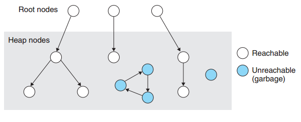

##  C程序中常见的与存储器相关的错误

- 间接引用坏指针
- 读未初始化的存储器
- 允许栈缓冲区溢出
- 假设指针和他们指向的对象是相同大小的
- 造成错位错误
- 引用指针而不是他们指向的对象
- 误解指针运算
- 引用不存在的变量
- 引用空闲堆块中的数据
- 引起存储器泄露

