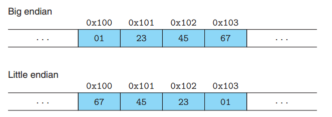
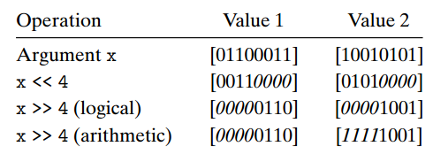
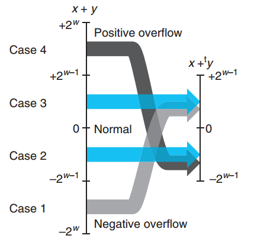
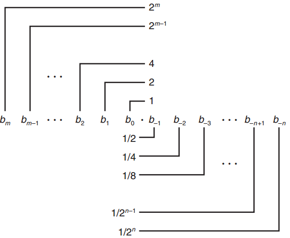
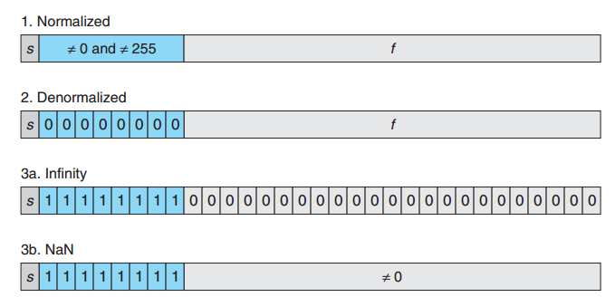
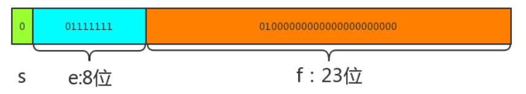
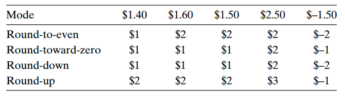

#  信息的表示和处理

## 信息存储

字节：大多数计算机都使用字节(byte)作为系统中最小内存单位，内存就可以看作一个巨大的 byte 数组。

虚拟地址空间：操作系统为程序提供虚拟内存(virtual memory)这一概念屏蔽了底层存储系统的复杂性，其中虚拟内存中每个字节都有自己的地址，也就是虚拟地址(virtual address)，虚拟内存中所有可能地址的集合就是虚拟地址空间(virtual address space)，C 语言中某个指针的值就是某个存储块第一个字节的虚拟地址。

### 十六进制

一个字节是8位，表示成二进制是`00000000 ~ 11111111`，表示成十进制的范围是`0 ~ 255`，表示成十六进制是`00 ~ FF`，很明显十六进制的表示方式更加简洁易用，计算机系统中通常以`0x`开头表示一个以十六进制展现的内存地址。

### 字长

所谓字长，就是指针携带的地址值的标称大小，32 位字长的机器其虚拟地址范围就是 `0 ~ 2^32`（最大虚拟地址值是`2^32-1`，也就是说 32 位字长的系统虚拟地址空间大小就是 4GB），64 位字长的机器其虚拟地址范围就是 `0 ~ 2^64（16EB）`。

### 寻址

一个对象在内存中是以连续的字节序列的形式存储的，对象的地址就是这段字节序列中最低位置的地址值。

对象字节序列中，开始位置的字节称为最低有效位，结束位置称为最高有效位，比如对于`0x01234567`这个 int 类型，最高有效位字节就是01，最低有效位字节是67。

### 字节顺序

对象在内存中的字节序列是由一定的顺序进行保存的，保存对象字节序列的顺序就是字节顺序，有大端法和小端法两种：

- 大端法：从最高有效位到最低有效位的顺序存储对象。
- 小端法：从最低有效位到最高有效位的顺序进行存储。



大多数 Intel 兼容机都是小端模式，IBM 和 Oracle 的服务器使用大端模式，不过现在很多微处理器都是双端模式，兼容两种模式。

#### 字符串的字节顺序


字符串类型的字节顺序与其他类型稍有不同，在任意平台上字符串都是正序排列。

### 布尔代数

布尔运算在计算机系统中占有很重要的地位，在数值位运算中运用尤为广泛。

本的布尔运算逻辑有四种：与 `&`，或 `|`，非 `~`，异或 `^`。

#### 位运算

有以下程序，可以将 x 和 y 的值互换：

```
#include <stdio.h>
void inplace_swap(int *x, int *y) {
    *y = *x ^ *y;
    *x = *x ^ *y;
    *y = *x ^ *y;
}
int main() {
    int x = 10;
    int y = 9;
    inplace_swap(&x, &y);
    printf("%d\n", x);
    printf("%d", y);
    return 0;
}
```

由此产生了一些结论：

- 异或运算中，任何值与0的异或结果还是它本身
- 异或运算中，任何值与它自己的异或结果为0
- 异或运算支持结合律

#### 逻辑运算

逻辑运算符和位运算符功能相似，不过逻辑运算符针对 Boolean 类型，而位运算符仅仅对数字做二进制位运算。

#### 移位运算

移位运算通常用于对数字的二进制位进行移动计算，具体的移位运算还包括逻辑移位和算术移位：



与逻辑右移位不同的是，算术右移位会在空出来的高位补足移位个数的最高有效位的值。

## 整数表示

### 无符号数

无符号数是没有负数编码的数字，最小值为0，在 C 语言中用`unsigned`进行声明，一般来说`int`表示有符号整形，`uintb`表示无符号整形。

无符号数编码唯一性：在计算机系统中无符号数的编码具有唯一性，比如无符号数`10`的二进制编码是`1010`，那么可以断言`1010`这个编码如果表示的是一个无符号数的话，那它对应的十进制就只能是`10`。

### 有符号数

补码是计算机系统中表示负数必不可少的编码手段，通过补码表示的数字的最高有效位是符号位，为 0 则表示正数，为 1 则表示负数，例如二进制数`1101`中，高位的 1 表示该数是一个负数，通过剩下三位可以计算出该负数的绝对值是 3，则该补码编码对应的十进制数是`-3`。

补码转换为十进制有符号数：以下是换算补码二进制数到十进制数的两种方式：

- 权重法：换算方式与无符号二进制转十进制的方式类似，不过高位符号位需要取负号：

```
1011: -1*2^3 + 0*2^2 + 1*2^1 + 1*2^0 = -5
0101: 0*2^3 + 1*2^2 + 0*2^1 + 1*2^0 = 5
```

- 取反法：判断最高有效位，如果最高位为 0，则为正数，计算方式与无符号数一致，如果为 1，则为负数，将最高位去掉，剩余位减去1后各位再取反，得到的二进制编码则是该负数的绝对值，比如上述例子中的`1011`去掉最高位后未`011`，减去 1 后为`010`，全部取反后为 `101`，转换为十进制为 `5`，则该负数是`-5`。

十进制有符号数转换为补码: 相应的，将十进制负数`-5`转换为补码形式`1011`就有以下方式：

```
# 绝对值转换为二进制： 101
# 二进制位全部取反： 010
# 加1： 011
# 加上符号位： 1011
```

## 整数运算

### 无符号加法

使用无符号加法需要注意溢出的情况，下列无符号 `short` 求和最后结果就发生了溢出，同样产生了截断，实际结果比理想的结果少了 `2^16`。

```
int a = 44444;
int b= 22222;
unsigned short c = a + b;
printf("a is %u, b is %u, result is %u \n", a, b, c);
```

最后结果为 1130，想要的结果是 66666。

### 补码加法

大部分时间进行数值计算都是对补码进行操作，在进行补码加法时需要考虑当结果太大或者太小时会不会发生溢出的情况。

与无符号加法类似，如果加法结果超过当前数值类型的位数范围时会发生正溢出（太大）或者负溢出（太小）：



```
int a = -22222;
int b= -22222;
short c = a + b;
printf("a is %d, b is %d, result is %d\n", a, b, c);
```

其结果为 21092，发生了负溢出，其结果比想要的结果大了 65536，也就是 `2^16`。

以下函数无法判断两个有符号补码数相加是否发生了溢出：

```
int check_overflow_short_add(int a, int b) {
    int c = a + b;
    return (c - a) == b && (c - b) == a;
}
```

两个补码 `a` 和 `b` 相加得到结果 `c`，不管有没有溢出，`c-a` 的结果始终还是 `b`，`c-b` 的结果始终还是 `a`。

### 无符号乘法

无符号乘法也存在高位截断的问题：

```
unsigned short a = 222;
unsigned short b = 333;
unsigned short c = a * b;
printf("%d\n", c);
```

理想结果为 73926，实际得到的结果为 8390，说明溢出的部分被截断了，只剩下了低 16 位的数据，也就是少了 `2^16`。

### 补码乘法

补码乘法与无符号乘法差不多，与补码加法一样也需要注意正溢出和负溢出截断的问题。

### 对于某些常数乘法的优化

乘法运算在大多数计算机上都是一个相当慢的运算，需要消耗过多的时钟周期，因此编译器对常数乘法运算会进行一些优化，用移位或者加法运算来代替常数因子的乘法运算。

移位优化：某个数与2的幂作乘法就可以进行移位运算，`X * 2^k` 就可以直接 `X` 左移 `k` 位。

加法优化：将乘数拆散为2的幂次的和，比如`X * 14`就可以拆为 `X * (2^3 + 2^2 + 2)`，然后再用移位计算各个部分的值，最后再统一相加。

## 浮点数

现代计算机采用IEEE浮点数标准来处理带小数点的数字。

### 二进制表示小数

与整数的二进制表示法类似，带小数的数字是用2的负幂次叠加来进行表示，比如 5.75 就可以拆散为：

`4 + 0 + 1 + 1/2 + 1/4`，用二进制进行表示就是：`101.11`

二进制用以下规则表示带小数的数字，整数部分就是2的正幂次，小数部分就是2的负幂次：



**缺陷**：可以看出，二进制表示小数无法做到像十进制这么精确，像 1/5 这种小数通过十进制可以表示为 0.2，但是用二进制的话只能通过增加二进制小数位数构造一个近似值来逼近，例如`0.00110011`这个二进制小数转换为十进制是`0.19921875`，已经很接近了。

### IEEE浮点数表示法

在二进制定点表示法的基础上，IEEE标准用以下公式来存储一个浮点数：
$$
V = {( - 1)^s}*M*{2^E}
$$
各个参数解释如下：

- `s`：符号标记，无论是 `float` 还是 `double` 类型都是有符号数，`s` 为1则表示负数，`s` 为0表示正数。
- `M`：尾数，保存浮点数的实际有效位，其大小是`1 <= M < 2`，以`1.1101`这样的形式展示；不过存储的时候会省略小数点左边的1，只存储右边的位，我们把保留下来的小数点右边的位称为 `f`。
- `E`：阶码，对尾数 `M` 进行加权，判断 `M` 的小数点需要左移或者右移多少位，最终计算得到真正的浮点数二进制表示。

计算机系统保存浮点数就是对这三个参数分别进行编码保存到固定的位数中，`float` 类型保存到 32 位长度中，`double` 类型则保存到 64 位长度中。

`float` 和`double` 除了最高位的符号位 s，剩下的区别主要体现在对M和E的保存位数不一样：

- `float`：E 取8位，M 取23位
- `double`：E 取11位，M 取52位

以 32 位的 `float` 为例讲一下编码保存各个参数的规则：

- 编码 s：保存为1或者0
- 编码 E：E 的值即要表现2的正幂次，也要表现2的负幂次，而编码保存后的八位数`e`只能是无符号整数，范围是 `0 ~ 2^8^-1=255`，因此 E 的真实取值范围需要在这个基础上做一个 `2^7^-1=127` 的偏移处理，也就是说`e = E + 127`
- 编码 M：省略掉 M 小数点左边的1，只保留小数点右边的 23 位，也就是`f`

基于这个基本表示规则，有四种不同的情况，以 32 位 `float` 为例：

- `E` 编码保存的值不为 0 或者 255(2^8-1)：这种情况即为普通情况，E 的取值范围是 -126 ~ 127。
- `E` 所有位都为 0：称为非规格化值，规定这种情况在解码时舍弃掉 M 小数点左边的1，只保留 f；这种情况一般时拿来表示正 0 或者负 0，或者非常逼近于0的小数。
- `E` 所有位都为1 & f 所有位为 0：无穷大数，s 为 1 是负无穷，s 为 0 是正无穷。
- `E` 所有位都为1 & f 不为 0：NaN，用来表现不是数字（无意义的数字）的情况。



以 `float` 类型`1.25`为例，计算机系统中使用 32 位二进制`00111111101000000000000000000000`来保存1.25：



- 符号位 s 为 0，表示正数

- 阶码位 e 有 8 位，其值是127，因此 `e = 127 - 127 = 0`，阶码 e 为 0

- 尾数位 f 有 23 位，其值是二进制 0.01，也就是 `1/(2^2) = 1/4`

### 舍入

因为表示方法限制类浮点数的范围和精度，浮点运算只能近似地表示实数运算。因此，对于值 x，我们一般想用一种系统的方法，能够找到“最接近的”匹配值，这就是舍入运算的任务。

常见的舍入方式有：向偶数舍入、向零舍入、向下舍入、向上舍入：



###  C语言的浮点数

`float` 和 `double`。在 `int`、`float` 和 `double` 格式之间进行强制类型转换时，程序改变数值和位模式的原则如下(假设 `int` 是 32 位的)：

- 从 `int` 转换成 `float`，不会溢出，可能被舍入。
- 从 `int` 或 `float` 转换成 `double`，能够保留精确的数值。
- 从 `double` 转换成 `float`，可能溢出成为正无穷或负无穷，也可能被舍入。
- 从 `float` 或者 `double` 转换成 `int`，值会向零舍入。例如 1.999 将被转换成 1。


