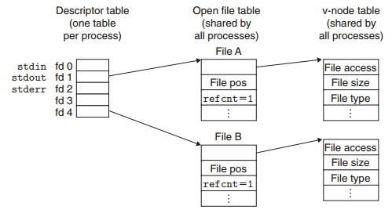
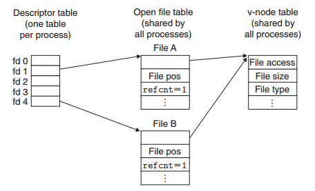
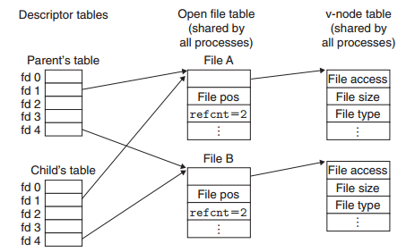
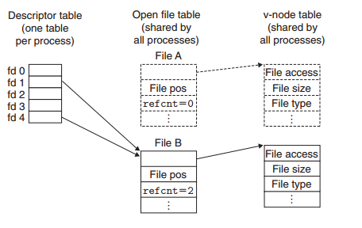

# 系统级I/O

输入/输出（I/O）是在主存（memory）和外部设备之间拷贝数据的过程。输入数据是从 I/O 设备拷贝数据到主存，输出数据是从主存拷贝数据到 I/O 设备。

## Unix I/O

所有的的I/O设备都模型化为文件，而所有的输入和输出都当作相应文件的读和写来执行。

所有的输入输出都以一种统一且一致的方式来执行：

- 打开文件
- 改变当前的文件位置
- 读写文件
- 关闭文件

## 打开和关闭文件

`open` 函数将 `filename` 转换为一个文件描述符，并且返回描述符数字。返回的描述符总是在进程中当前没有打开的最小描述符。

## 读和写文件

`read`函数从描述符为 `fd` 的当前文件位置拷贝至多 `n` 个字节到存储器位置 `buf`。

`write` 函数从存储器位置拷贝至多 `n` 个字节到描述符fd的当前文件位置。

通过调用`lseek`函数，应用程序能够显式地修改当前文件的位置。

## 共享文件

可以用许多不同的方式来共享 Unix 文件。内核用三个相关的数据结构来表示打开的文件：

- 描述符表(descriptor table)。每个进程都有它独立的描述符表，它的表项是由进程打开的文件描述符来索引的。每个打开的描述符表指向文件表中的一个表项。
- 文件表(file table)。打开文件的集合是由一张文件表来表示的，所有的进程共享这张表。每个文件表的表项包括当前的文件位置、引用计数(reference count)，以及一个指向 v-node 表中对应表项的指针。
- v-node 表(v-node table)。同文件表一样，所有的进程共享这张表。每个表项包含 `stat` 结构中的大多数信息。

多个描述符也可以通过不同的文件表表项来引用同一个文件：

子进程继承父进程打开文件：

## I/O重定向

## 我们该使用哪些I/O函数

