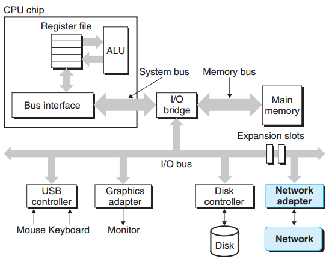
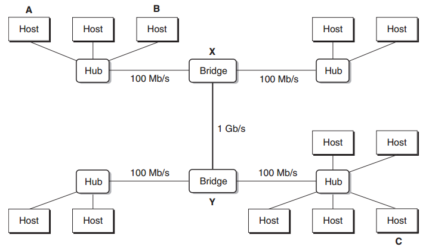
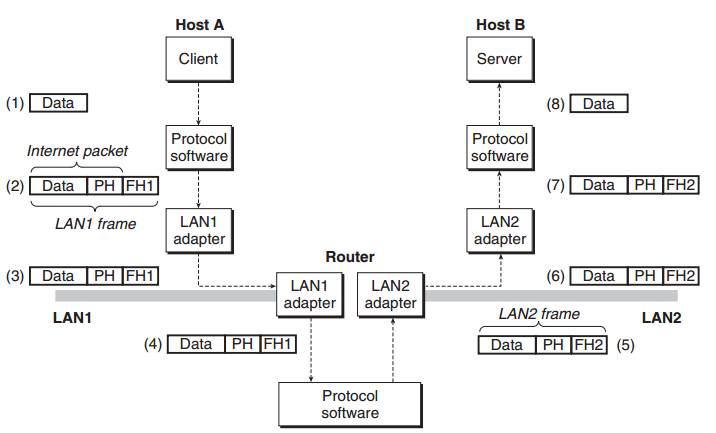
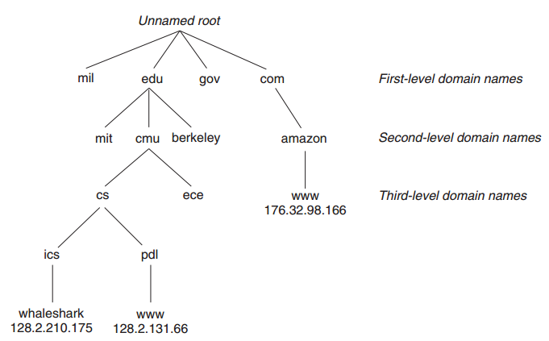
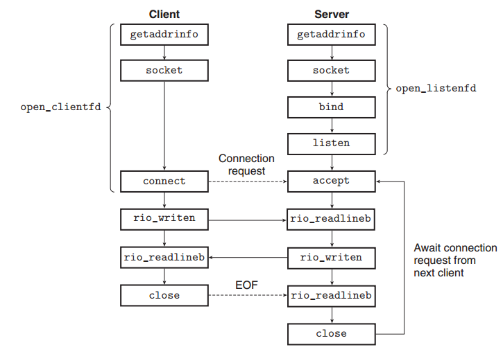
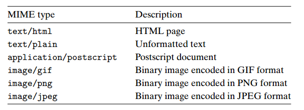

# 网络编程

网络应用随处可见。有趣的是，所有的网络应用都是基于相同的基本编程模型，有着相似的整体逻辑结构，并且一来相同的编程接口。

网络应用依赖于很多在系统研究正已经学习过的概念，例如，进程、信号、字节顺序、存储器映射以及动态存储分配，都扮演着重要的角色。

## 客户端-服务器编程模型

每一个网络应用都是基于客户端-服务器模型的，采用这个模型，一个应用是由一个服务器进程和一个或者多个客户端进程组成。服务器管理某种资源，并且通过操作这种资源来为它的客户端提供某种服务。

客户端-服务器模型中的基本操作是事务：

认识到客户端和服务器是进程，而不是机器或者主机，这一点很重要。

## 网络

客户端和服务器通常运行在不同的主机上，并且通过计算机网络的硬件和软件资源来通信。对于一台主机而言，网络只是又一种 I/O 设备，作为数据源和数据接收方，如下图所示：

物理上而言，网络是一个按照地理远近组成的层次系统。最底层是 LAN(Local Area Network, 局域网)，在一个建筑或者校园范围内。迄今为止，最流行的局域网技术是以太网(Ethernet)。

每个以太网适配器都有一个全球唯一的 48 位地址，一台主机可以发送一段位，称为帧(frame)，到这个网段内的其他任何主机。每个帧包括一些固定数量的头部(header)位，用来标识此帧的源和目的地址以及此帧的长度，伺候紧随的就是数据位的有效载荷。每个主机适配器都能看到这个帧，但是只有目的主机实际读取它。

使用一些电缆和叫做网桥(bridge)的小盒子，多个以太网段可以连接成较大的局域网，称为桥接以太网(bridged Ethernet)，如下图所示：

在层次更高的级别中，多个不兼容的局域网可以通过叫做路由器(router)的忒书计算机连接起来，组成一个 internet (互联网络)。

internet（互联网络）至关重要的特性是，它能采用完全不同和不兼容技术的各种局域网和广域网组成。

在互联网中，数据是如何从一台主机传送到另一台主机的：

##  全球IP因特网

协议软件消除了不同网络之间的差异，必须具备两种基本能力：命名机制和传送机制。

每台因特网主机都运行实现 TCP/IP 协议(Transmission Control Protocol/Internet Protocol)的软件，几乎每个现代计算机系统都支持这个协议。

TCP/IP 实际上是一个协议族，其中每一个都提供不同的功能。从程序员角度，我们可以把因特网看做一个世界范围的主机集合，满足以下特性：

- 主机集合被映射为一组 32 位的 IP 地址
- 这组 IP 地址被映射为一组称为因特网域名(Internet domain name)的标识符
- 因特网主机上的进程能够通过连接(connection)和任何其他因特网主机上的进程通信

### IP 地址

一个 IP 地址就是一个 32 位无符号整数。IP 地址通常是以一种称为点分十进制表示法来表示的，这里，每个字节由它的十进制值表示，并且用句点和其他字节间分开。

### 因特网域名

域名集合形成了一个层次结构，每个域名编码了它在这个层次中的位置。

因特网定义了域名集合和 IP 地址集合之间的映射，这个映射是通过分布世界范围内的数据库——DNS（域名系统）来维护的。

### 因特网连接

因特网客户端和服务器通过在连接上发送和接收字节流来通信。从连接一对进程的意义上而言，连接是点对点的。从数据可以同时双向流动的角度来说，它是全双工的。并且由源进程发出的字节流最终被目的进程以它发出的顺序收到它的角度来说，它是可靠的。

一个套接字是连接的一个端点。每个套接字都有相应的套接字地址，是由一个因特网地址和一个 16 位的整数端口组成的，用地址:端口来表示。当客户端发起一个连接请求时，客户端套接字地址中的端口是由内核自动分配的，称为临时端口(ephemeral port)。然而，服务器套接字地址中的端口通常是某个知名的端口，是和这个服务相对应的。例如，Web 服务器通常使用端口 80，而电子邮件服务器使用端口 25。在 Unix 机器上，文件 `/etc/services` 包含一张这台机器提供的服务以及它们的知名端口号的综合列表。

一个连接由它两端的套接字地址唯一确定。这对套接字地址叫做套接字对(socket pair)，由下列元组来表示：

## 套接字接口

套接字接口(socket interface)是一组函数，它们和 Unix I/O 函数结合起来，用以创建网络应用。

## Web服务器

### Web基础

Web 客户端和服务器之间的交互用的是一个基于文本的应用级协议，叫做 HTTP(Hypertext Transfer Protocol)。HTTP 是一个简单的协议。一个 Web客户端打开一个到服务器的因特网连接，并且请求某些内容。服务器响应所请求的内容，然后关闭连接。浏览器读取这些内容，并把它显示在屏幕上。

### Web内容

对于 Web 客户端和服务器而言，内容是一个与 MIME(Multipurpose Internet Mail Extensions)类型相关的字节序列。

Web 服务器以两种不同的方式向客户端提供内容：

- 取一个磁盘文件，并将它的内容返回给客户端。磁盘文件称为静态内容(static content)，而返回文件给客户端的过程称为服务静态内容(serving static content)。
- 运行一个可执行文件，并将它的输出返回给客户端。运行时可执行文件产生的输出称为动态内容(dynamic content)，而运行程序并返回它的输出到客户端的过程称为服务动态内容(serving dynamic content)。

每条由 Web 服务器返回的内容都是和它管理的某个文件相关联的。这些文件中的每一个都有一个唯一的名字，叫做 URL(Universal Resource Locator)。

关于服务器如何解释一个 URL 的后缀，以下几点需要理解：

- 确定一个 URL 指向的是静态内容还是动态内容没有标准的规则。每个服务器对它所管理的文件都有自己的规则。一种常见方法是，确定一组目录，例如 cgi-bin，所有的可执行文件都必须存放这些目录中。
- 后缀中的最开始的那个 `/` 不表示 Unix 的根目录。相反，它表示的是被请求内容类型的主目录。例如，可以将一个服务器配置成这样：所有的静态内容存放在目录 `/usr/httpd/html` 下。
- 最小的 URL 后缀是 ` / ` 字符，所有服务器将其扩展为某个默认的主页，例如 `/index.html`。这解释了为什么在浏览器中键入一个域名就可以取出一个网站的主页。浏览器在 URL 后添加缺失的 ` /`，之后服务器把 ` /`  扩展到某个默认的文件名。

### HTTP事务

因为 HTTP 是基于在因特网连接上传送的文本行的，我们可以使用 Unix 的 TELNET 程序来和因特网上的任何 Web 服务器执行事务。

