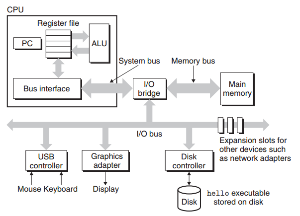
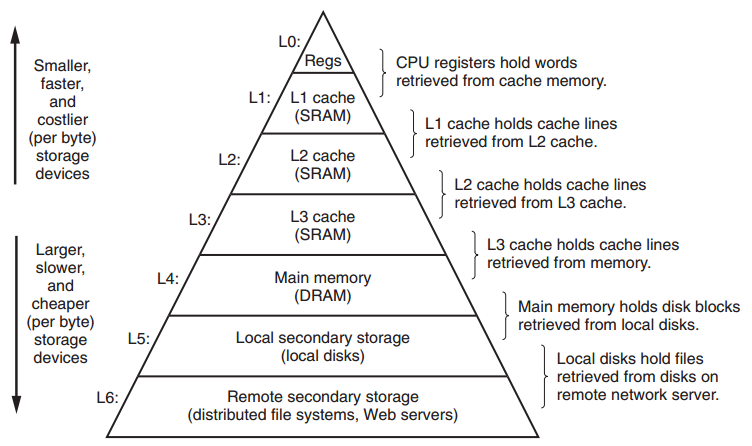
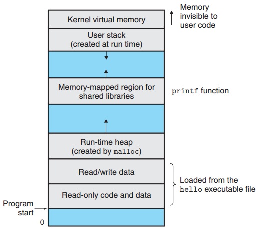

# 计算机系统漫游

## 信息就是Bits+上下文

计算机系统中所有信息（内存中的数据，用户编写的程序，磁盘中的文件，网络中传输的信号和文件等）都是以一串 bit 表示的。

如何区分这些 bit 串要表达的不同含义？这时就需要判断这些 bit 串的上下文，不同的 bit 串在不同的上下文中可能表示一个整数，一个字符串或者一个特殊的 cpu 指令。

## 程序被其他程序翻译成不同的格式

一个高级语言写的程序（这里以 C 语言为例），从源代码到最终的机器中的可执行文件会经过一下几个阶段：

- 预处理阶段，处理源码的中的预处理语句（比如说#include）
- 编译阶段，将c语言编译成汇编语言
- 汇编阶段，把汇编语言翻译成机器指令
- 链接阶段，把在程序中调用的库函数的相关文件引入

例如：

```
#include <stdio.h>

int main()
{
	printf("hello world\n");
	return 0;
}
```

编译：

```
gcc -o hello hello.c
```


## 了解编译系统如何工作室大有益处的

促使程序员要知道编译系统是如何工作的原因：

- 优化程序性能，我们需要对汇编语言以及编译器如何将不同的C语句转化为汇编语言有基本的了解
- 理解链接时出现的错误
- 避免安全漏洞，其中一个比较典型的是缓冲区溢出错误

##  处理器读取并解释存储在存储器中的指令

一个计算机系统的硬件主要由以下几个部分组成：

- 处理器CPU：系统的大脑，负责执行程序机器指令，由算术逻辑单元 ALU，程序计数器 PC，寄存器组成，PC 指向主存中某条需要执行的机器指令，由 ALU 读取该指令并执行该指令的操作，再更新 PC 使其指向下一条指令。
- 主存：包括 RAM 临时存储和 ROM 永久存储，主存是系统 cpu 执行指令时用来临时存放程序指令和数据的地方，每个主存的存储字节都有其唯一的地址。
- I/O设备：包括显示器，鼠标键盘，网卡和磁盘等用于系统和外界交互的硬件设备，每个 I/O 设备都需要适配器与 I/O 总线相连。
- 总线：一个携带信息字节负责在各个部件间传输信息的电子管道，总线传输宽度由字长确定，现代操作系统一般为32位字长或者64位字长。



执行一个 hello 程序的过程有一下几部：

- shell 程序会启动一系列指令将二进制可执行文件从磁盘通过 I/O 总线加载到主存中（通过 DMA 技术直接将数据拷贝到主存而不经过 cpu 的加载和存储等操作）。
- hello 文件加载到主存后，cpu 通过内存总线读取主存中的机器指令，这些指令会将 "hello world" 字符串从主存复制到cpu 寄存器，再从寄存器通过 I/O 总线输出给显卡适配器。
- 显卡适配器获取到具体需要打印的 “hello world” 字符串，将信息输出到屏幕上。

## 高速缓存

以上 hello 程序执行的过程中，需要先把信息从磁盘复制到主存，再由 cpu 根据指令从主存复制字符串信息到寄存器，然后再输出给 I/O，这一来一去的复制过程大大降低的程序的执行速度，因为 cpu 从寄存器中读数据速度远大于从主存中读取数据，复制过程就成了瓶颈。

高速缓存利用了空间和时间局部性原理，存放 cpu 近期可能会用到的信息能够大大降低 cpu 从主存读取数据带来的运行瓶颈。

主流 cpu 采用 SRAM 技术，一共将高速缓存分为 L1,L2 和 L3 三个层级，其中最靠近 cpu 的 L1 高速缓存存取速度最快，容量也最低。

## 存储设备的层次结构

计算机系统中的存储设备组织成一个存储器层次结构，从小往上，存储容量越小，访问速度越快：



## 操作系统管理硬件

用户的应用程序，比如一个 shell 脚本程序，或者一个 c 程序，是无法直接和系统硬件打交道的，取而代之的是操作系统，充当了用户程序和系统底层硬件的中间层，提供了统一的系统调用让用户程序间接访问系统硬件，这么做有两个目的：

- 防止用户程序失控滥用系统硬件。
- 向用户程序提供简单一致的机制来对付复杂的底层硬件。

通过进程，虚拟内存和文件系统这几种机制来实现以上两个目的。

### 进程

进程是现代操作系统中最重要的一个概念，操作系统使用进程这个概念来使得某一个应用程序与本机上其他应用程序进行资源隔离，并且让这个应用程序以为本台机器上只有它自己一个程序在运行。

- 单个 CPU 核心同一时间只能运行一个程序，如何让多个程序运行在这个 CPU 核心上？CPU 通过上下文切换来并发地处理多个进程。
- 进程的上下文包含该进程的 PC，寄存器和主存中暂存的数据。
- CPU 执行进程的上下文切换时需要切换到内核态。

### 线程

现代操作系统中，一个进程可以由多个线程组成，每个线程相互之间共享进程的代码和全局数据，可以把进程看作轻量级的进程，CPU 也是并发地处理多个线程的请求，同样也会存在上下文切换的情况。

### 虚拟内存

操作系统为了让进程更方便地管理自己的内存空间，使用虚拟内存这一概念为每个进程提供一个抽象，让进程认为自己独占了整个内存空间，因此进程操作的内存地址空间都是操作系统创建出来的虚拟内存地址空间，底层真实内存地址空间是不提供给进程直接访问的。

虚拟内存地址空间的组成如下：

- 只读代码和数据区：包含程序代码数据和全局变量，进程初始化时就被分配。
- 运行时堆：堆可以动态缩/扩容，通过 `malloc` 和 `free` 等函数动态分配的内存。
- 共享库：存放 `C`  标准库等需要共享的代码和数据，与动态链接有关。
- 栈：编译器使用栈这种数据结构来实现函数调用，用户栈在运行时也可以动态缩/扩容。
- 内核虚拟内存：为内核调用保留的地址空间。



### 文件

在类 Unix 系统中，万物皆文件，包括磁盘，网络以及键盘鼠标显示器等 IO 设备，都看作文件。

操作系统使用文件系统这一概念将底层 IO 设备进行了抽象，应用程序无需关注硬件设备复杂的实现技术，只需要关注操作系统提供的文件系统接口就行了。


